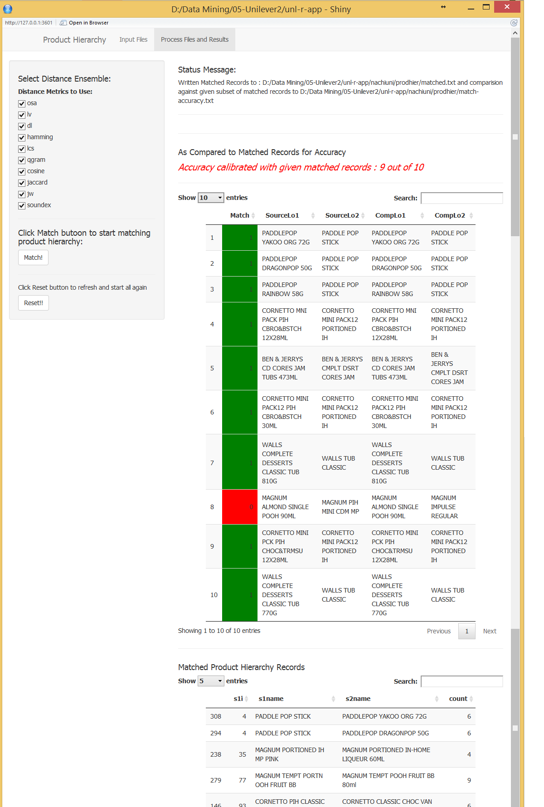
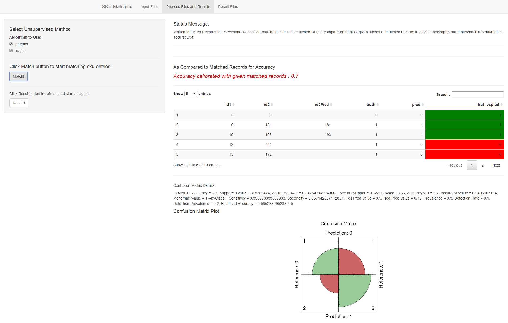

#Data Blending Challenge - DeDuplication using ML Techniques#
----------

##Business Problem##
This retail gaint deals with internal structured data pertainig to customer biz addressess, SKU product codes & description and product heirarchy descriptions for each SKU. It buys/collects data from external vendors to augument its marketing reach and in the process, the external datasets have thier owm nomenclature. i.e. fields and descriptions are bit different but pointing to same data row/record. Hence data needs to be matched accurately to get meaningful analytics. Problem needs to address 3 datasets namely Address, SKU and Product Hierarchy (classifications).

##Proposed Solution and ShinyR PoC Web App##
<small><i>[ShinyR Web App code is in the above folders submitted on Apr 2016 and also hosted in RStudio's cloud app platform ShinyApps.io]</i></small>

Data blending in this context is basically a subset of Record
Linkage and De-Duplication problem. Given the constraints of data which
can’t be fitted into a definitive way of comparing individual fields or
use them to narrow the amount of search is a unique problem to be
solved.

Address fields are free form data which can’t leverage ‘Blocking’ which
is the reduction of the amount of data pairs through focusing on
specified agreement patterns. Whereas SKU dataset can leverage this
feature to a limited extend and Product Hierarchy utilizes a pure simple
weighted distance ensemble.

Solution aspects are discussed against each dataset with PoC wep app hosted seperately. 

> **Team**
>
> **Nachi Nachiappan**, a data practioner, has worked in enterprise IT
> industry for 15 years and possess diverse business domain expertise
> including exposure to retail & financial industries. Data science
> being my passion, I keep dabbling on such projects and I hope this
> proposal is worth that effort to positively make some impact on data
> blending in enterprise and public realm.

[1. Methodology and Effectiveness ](#_Toc448178836)

[2. Accuracy Measurement ](#_Toc448178837)

[3. Implementation & Adoption ](#_Toc448178838)

[4. Conclusion ](#_Toc448178839)

[5. References & Consideration ](#_Toc448178840)

Data blending for Unilever’s problem broadly involves the following
steps:

1.  Data Preparation

2.  Basic Stochastic Distance Measurement / Blocking

3.  Unsupervised Learning

4.  Ensemble of Distance Measurements

Above process is used fully and sparingly based on each dataset
properties and blending requirements

##1. Methodology and Effectiveness##

**Data Preparation:**

<table>
 <tr>
  <td width=176>
  
Address Dataset

  </td>
  <td width=516>
  
All fields are already in Upper
  Case and no further data prep is required.

  
All fields are merged into one
  field

  </td>
 </tr>
 <tr>
  <td width=176>
  
SKU Dataset

  </td>
  <td width=516>
  
Package in Internal Dataset was
  reduced to Plastic for 'BOTTLE', 'SACHET', 'POUCH'

  
SUBGEMENT and CATEGORY were ignored

  
All data were lower-cased

  
PACKSIZE whitespaces were removed
  and for those not present were borrowed from 'SIZE' field

  
New DESCRP field was created from
  rest of the fields

  </td>
 </tr>
 <tr>
  <td width=176>
  
Product Hierarchy

  </td>
  <td width=516>
  
All fields are already in Upper
  Case and no further data prep is required. This dataset has only single field

  </td>
 </tr>
</table>

**Basic Stochastic Distance Measurement / Blocking:**

<table>
 <tr>
  <td width=176>
  
Address Dataset

  </td>
  <td width=516>
  
Uses 'Ensemble of Distance Measurements'
  straightaway 

  </td>
 </tr>
 <tr>
  <td width=176>
  
SKU Dataset

  </td>
  <td width=516>
  
Uses:

  
Basic Stochastic Distance
  Measurement with phonetic function and string compare function using 'jarowinkler'

  </td>
 </tr>
 <tr>
  <td width=176>
  
Product Hierarchy

  </td>
  <td width=516>
  
Uses 'Ensemble of Distance
  Measurements' straightaway

  </td>
 </tr>
</table>

**Unsupervised Learning**

<table>
 <tr>
  <td width=176>
  
Address Dataset

  </td>
  <td width=516>
  
None 

  </td>
 </tr>
 <tr>
  <td width=176>
  
SKU Dataset

  </td>
  <td width=516>
  
Uses:

  
A clustering algorithm is applied
  to find clusters in the comparison patterns. In the case of two

  
clusters (the default), the cluster
  further from the origin (i.e. representing higher similarity values) is
  interpreted as the set of links, the other as the set of non-links.

  
Supported methods tried are: K-means
  clustering and Bagged clustering

  </td>
 </tr>
 <tr>
  <td width=176>
  
Product Hierarchy

  </td>
  <td width=516>
  
None

  </td>
 </tr>
</table>

 
**Ensemble of Distance Measurements**

<table>
 <tr>
  <td width=176>
  <table>
     <tr>
     <td>
Address Dataset
</td>
     </tr>
     <tr>
      <td width=176>
      
SKU Dataset

      </td>
     </tr>
     <tr>
      <td width=176>
      
Product Hierarchy

      </td>
     </tr>
  </table>
  
  </td>
  <td width=516>
  
An ensemble of distance functions
  are used with different distance metrics. Unrestricted comparison patterns for
  all possible data pairs: n · m for linking two data sets with n and m records.
  

  
Distance functions include the
  following:

  
Method name -- Description

  
1.&nbsp;&nbsp;&nbsp;&nbsp;&nbsp; osa - Optimal
  string aligment, (restricted Damerau-Levenshtein distance).

  
2.&nbsp;&nbsp;&nbsp;&nbsp;&nbsp; lv - Levenshtein
  distance (as in R's native adist).

  
3.&nbsp;&nbsp;&nbsp;&nbsp;&nbsp; dl - Full
  Damerau-Levenshtein distance.

  
4.&nbsp;&nbsp;&nbsp;&nbsp;&nbsp; hamming -
  Hamming distance (a and b must have same nr of characters).

  
5.&nbsp;&nbsp;&nbsp;&nbsp;&nbsp; lcs - Longest
  common substring distance.

  
6.&nbsp;&nbsp;&nbsp;&nbsp;&nbsp; qgram -
  q-gram distance.

  
7.&nbsp;&nbsp;&nbsp;&nbsp;&nbsp; cosine -
  cosine distance between q-gram profiles

  
8.&nbsp;&nbsp;&nbsp;&nbsp;&nbsp; jaccard -
  Jaccard distance between q-gram profiles

  
9.&nbsp;&nbsp;&nbsp;&nbsp;&nbsp; jw - Jaro, or
  Jaro-Winker distance.

  
10.&nbsp; soundex -
  Distance based on soundex encoding 

  
&nbsp;

  
Ensemble is performed by finding all
  distances m pairs for a given nth pair  and finding valid
  distances in all metrics and taking a pair that has all distances measured
  with a valid value and is the least among the pairs.

  
&nbsp;

  </td>
 </tr>

</table>

**How does it solve the problem?**

Basic data prep, distance measurements and unsupervised learning provide
a base set upon which reduction is performed using ‘Ensemble Distance
Measurement’ to achieve the results. No supervised learning is used as
the dataset lacks huge training sample and better domain knowledge.
Whereas our strategy is a generic one and can be applied to any dataset
without prior domain knowledge but can be optimized and fine-tuned
further with more domain knowledge and also can explore supervised
training if that is possible.

**What makes the solution robust?**

<table>
 <tr>
  <td width=176>
  
Address Dataset

  </td>
  <td width=516>
  
Unrestricted mxn Single
  unified column matching

  </td>
 </tr>
 <tr>
  <td width=176>
  
SKU Dataset

  </td>
  <td width=516>
  
A set of blocking to reduce and
  then ensemble to narrow the match and is effective 

  </td>
 </tr>
 <tr>
  <td width=176>
  
Product Hierarchy

  </td>
  <td width=516>
  
Unrestricted mxn pair Single
  unified column matching

  </td>
 </tr>
</table>

Huge datasets may have an issue on m~x~n unrestricted distance
calculation but may not be heavy compute cost given the cloud compute is
very low.

**How does the solution handle various cases of mapping?**

A full-fledged solution may need to match the level of functionality as
***open source FEBRL*** application which has all permutations. Due to
time constraint mapping is performed in the code and not exposed as a
generic interface and can be co-developed if this solution/algorithm is
selected.

##2. Accuracy Measurement##

<table>
 <tr>
  <td width=176>
  
Address Dataset

  </td>
  <td width=516>
  
TBD (still working)

  </td>
 </tr>
 <tr>
  <td width=176>
  
SKU Dataset

  </td>
  <td width=516>
  
0.7 (70% Accuracy)

  </td>
 </tr>
 <tr>
  <td width=176>
  
Product Hierarchy

  </td>
  <td width=516>
  
9 out of 10 (90% Accuracy)

  </td>
 </tr>
</table>

SKU :

 </img>

Product Hierarchy:

 </img>

##3. Implementation & Adoption##

**Prototypes hosted @**

You can access the apps as here:

<table>
 <tr>
  <td width=138>
  
<b>Dataset</b>

  </td>
  <td width=300>
  
<b>URL</b>

  </td>
  <td width=254>
  
<b>Input Files (use these
  files in the Shiny.R web app)</b>

  </td>
 </tr>
 <tr>
  <td width=138>
  
<b>Address </b>

  </td>
  <td width=300>
  
<a
  href="https://unileve2.shinyapps.io/addr-match/">https://unileve2.shinyapps.io/addr-match/</a>

  
<b>(still work in progress)</b>

  </td>
  <td width=254>
  
Addr-DataSet1.txt

  
Addr-DataSet2.txt

  
Addr-Match.txt

  </td>
 </tr>
 <tr>
  <td width=138>
  
<b>SKU </b>

  </td>
  <td width=300>
  
<a
  href="https://unileve2.shinyapps.io/sku-match/">https://unileve2.shinyapps.io/sku-match/</a>

  
&nbsp;

  </td>
  <td width=254>
  
Sku-Internal-Dataset.txt

  
Sku-ExtNielson-Dataset.txt

  
SKU_Match.txt

  </td>
 </tr>
 <tr>
  <td width=138>
  
<b>Product Hierarchy</b>

  </td>
  <td width=300>
  
<a
  href="https://unileve2.shinyapps.io/unl-r-app/">https://unileve2.shinyapps.io/unl-r-app/</a>

  
&nbsp;

  </td>
  <td width=254>
  
Prod-lo1-lo2-ToMatch.txt

  
Prod-match.txt

  </td>
 </tr>
</table>

**How easily the solution can be implemented?**

It is a simple yet powerful solution strategy using standard record
linkage and de-duplication concepts and distance metrics. Can be
implemented as Shiny.R app and can be deployed for enterprise use. This
prototype uses Shiny.R to demonstrate the algorithm interface and
utilizes various R packages like RecordLinkage, stringDist, BioString,
etc.

**Any risk in implementation?**

Every project and endeavor has some risk and here are the things to
consider:

1.  More data points to test the algorithm’s consistency

2.  Does data structure change a lot – need to be studied to this
    tailored algorithm

3.  Huge dataset performance to be measured

4.  Data matching ambiguity needs to have a proper user interface to
    mark proper matching and store it for future supervised or
    unsupervised algorithms.

**Experimental Frameworks Considered:**

1.  Simple Distance measurements won’t suffice

2.  Supervised were considered but training dataset is unavailable

3.  Unsupervised – Kmeans and Bclust

4.  Stochastic – epiWeights and emiWeights

5.  Combination of Distances – Simple Distance Ensemble

<!-- -->

##4. Conclusion##

For this retail giant's Data Blending – a simple, powerful yet uncomplicated
algorithm that used unsupervised reduction using Distance Ensemble is
proposed which gives consistent and good results.

##5. References & Consideration##

**Books**

Data Matching – Springer

[High Performance Record
Linkage](http://datamining.anu.edu.au/projects/linkage-links.html)
